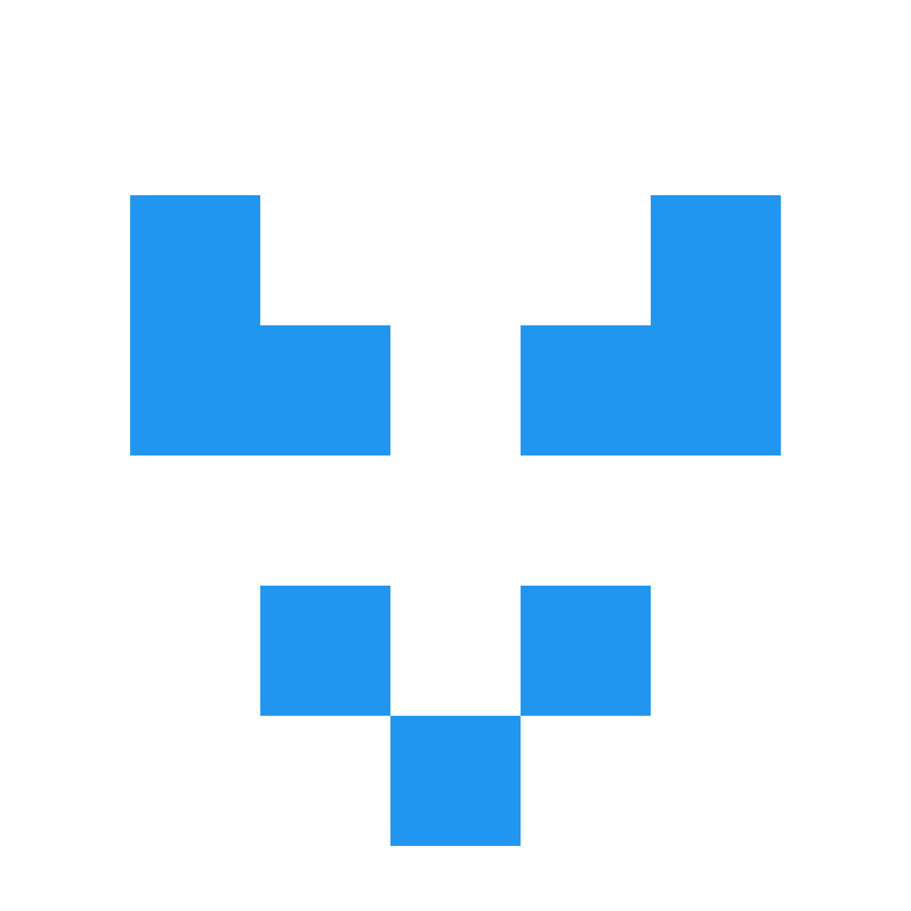

# Hello 

### Contact

 

### Languages

 

### Tools and Technologies

 
 

### GitHub

&nbsp;

### Projects

&nbsp;

[Dark theme version](https://github.com/OliverKovacs/OliverKovacs/blob/main/README.md)
